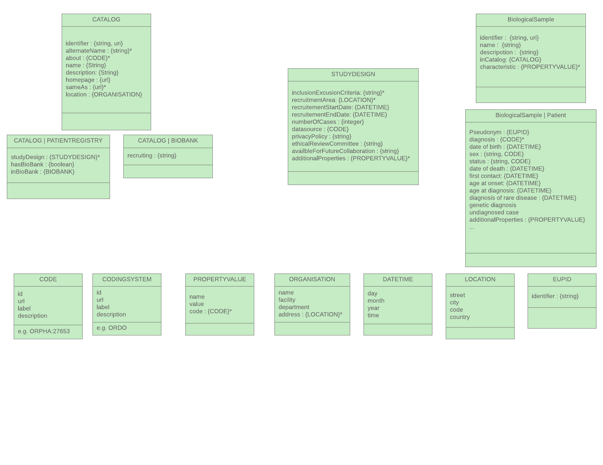

# Metadata for EJP rare disease registries, biobanks and catalogs

As part of the [European Joint Programme (EJP) for Rare Disease](http://www.ejprarediseases.org), we are developing minimal schemas for rare disease resources to expose metadata to the EJP virtual platform (VP).
The schemas are expressed as a number of schema blocks that can be combined to create rich metadata objects. The schema blocks will be published as JSON schem modules with a semantic mapping to standard vocabularies using JSON-LD.

The core model is designed to represent data about a rare disease resource, these include rare disease registries, biobanks, expert networks and catalogs of resources. The model is based on and builds on existing standards, such as the [European Rare Disease Registry Infrastructure](https://eu-rd-platform.jrc.ec.europa.eu) and the [Common Data Elements](http://www.erare.eu/sites/default/files/SetCommonData-EU%20RD%20Platform_CDS%20_final.pdf) initiatives in the rare diesease community and other more generalised initiatives such as the W3C [DCAT vocabulary](https://www.w3.org/TR/vocab-dcat/). We are also working to align with similar schema standarisation efforts such as [schema.org](https://schema.org), [bioschemas](https://bioschemas.org) and [GA4GH](https://www.ga4gh.org) (see also [schema blocks](https://schemablocks.org) and [phenopackets](http://phenopackets.org).

> Status: DRAFT - 1st May, 2019. This is currently a strawman proposal intended to generate discussion and help in developing an early demonstrator. 

## Schema block elements overview

This diagram illustrates the basic idea of a schema block. Blocks are reusable components and new blocks can be defined that inherit from parent blocks. 

## Resource level JSON schema

A example of a catalogue block in JSON schema is described in [rd_resource_metadata.json](rd_resource_metadata.json).

A simplified representation of the same data in CSV format is in [rd_resource_metadata.csv](rd_resource_metadata.csv).

### Example data

An example instance of a resource level metadata [taken from Orphanet](https://www.orpha.net/consor4.01/www/cgi-bin/Directory_Institutions.php?lng=EN&data_id=24435&title=Selbsthilfegruppe%20Ektodermale%20Dysplasie&data_type=Test) can be seen in [orphanet_24435.json](examples/orphanet_24435.json).

### RDF + JSON-LD

You can apply the JSON-LD context from [rd_resource_metadata.jsonld](rd_resource_metadata.jsonld) to any JSON document to generate an RDF representation. An example of a resource entry in
RDF turtle format is in [orphanet_24435.ttl](examples/orphanet_24435.ttl)

### Schema.org

The schema blocks are designed to be compatible with schema.org style markup that allows you embedd the metadata into Web pages. Both RDFa and JSON-LD representations are supported microformats. See an (example of a draft schema.org proposal)[http://schema.semanticsfirst.com/devSpecs/PatientRegistry/] for a patient registry. 

## Use cases

* Provide minimal metadata to describe a rare disease registry or biobank, or a catalog of registries or biobanks. The metadata should
be sufficent to expose data aboutthese resource through the virtual platform
* Provide a uniform way for resources to expose the primary disease using a Orphanet code so that resources can be searched by disease in the virtual platform
* Provide a mechanism to identify resources and harmonise duplicate resources across catalogs
* Provide geographical infomation so resources can be filtered by country in the VP
* Expose if resources contain data about individuals with a rare disease e.g. a patient registry
* Expose if resources provide metrics about individuals, such as number of cases
* Expose if a resource has access to biological samples, such as tissue or cell ines.
* Expose if the resource has further contact information
* ...
